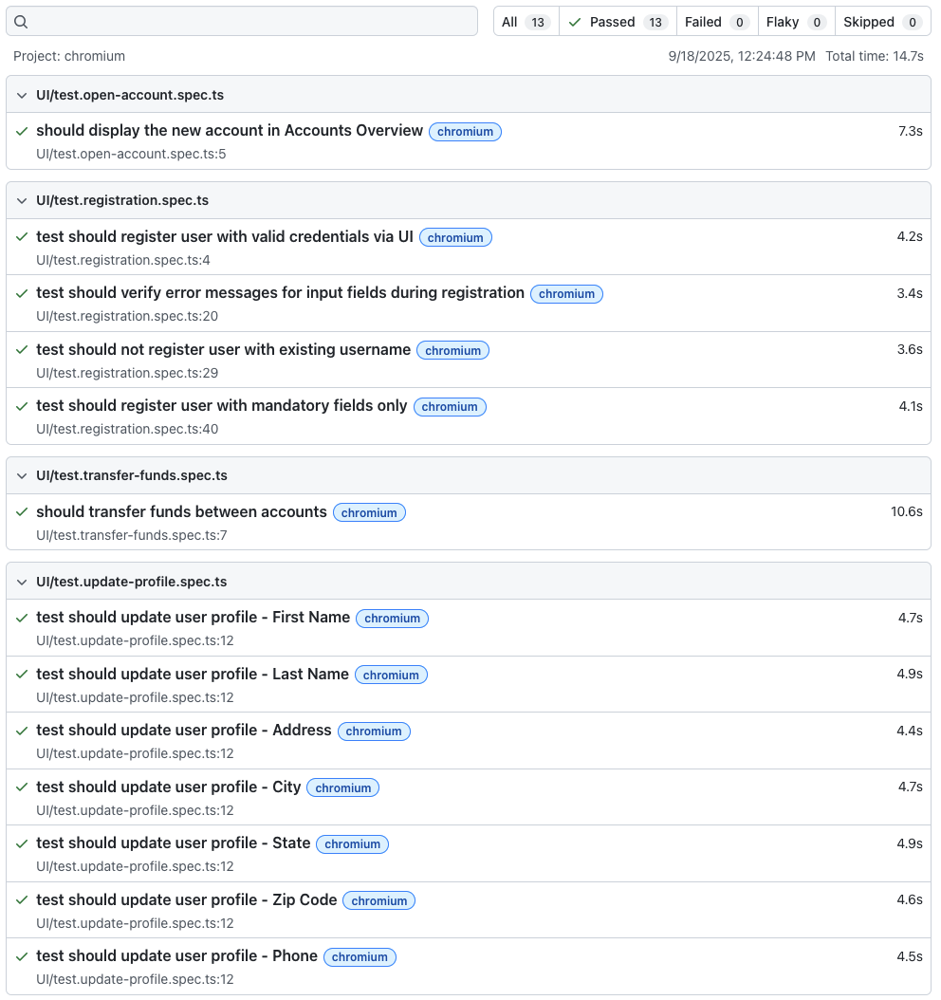

# ParaBank Test Automation

Playwright-based test automation for ParaBank application using TypeScript and Page Object Model pattern.

## Setup

```bash
npm ci
npx playwright install --with-deps
```

## Running Tests

```bash
# Run all tests
npx playwright test

# Run specific test
npx playwright test tests/UI/test.registration.spec.ts

# Run with UI
npx playwright test --ui

# Run in headed mode
npx playwright test --headed
```

## Architecture

- **Page Object Model**: Page classes in `src/pages/` extend `BasePage`
- **Custom Fixtures**: Extended test base with `app` and `validUser` fixtures
- **User Model**: Temporary value system for testing profile updates
- **App Class**: Main entry point managing page objects and application state


UI Automaiton
- test.registration.spec.ts, test.open-account.spec.ts - verifies registration of user with all valid fields. Negative scenarios, edge cases, security verifications for fields, error messages, registration where user is already created, email exists in database shoud be added. Validation of UI error messages.
- test.update-profile.spec.ts - validation of updating fields one by one. Scenarios where all fields updated, edge cases, security verifications for fields, error messages should be added later.
- transfer-funds.spec.ts - end-to-end scneario that validates account found transfer.

Test Results
